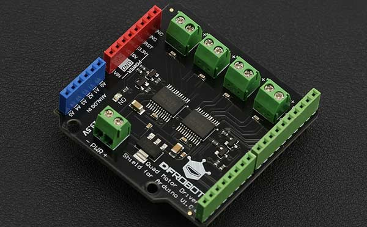

# MAIXDUINO LIBRARY FOR DFROBOT DRI0039 QUAD MOTORS DRIVER 




---------------------------------------------------------

## Table of Contents

* [URL](#url)
* [Summary](#summary)
* [Blocks](#blocks)
* [License](#license)
* [Supported targets](#Supportedtargets)

## URL
* Project URL : ```https://github.com/CwavGuy/Maixduino-ext-DRI0039-Mindplus```

* Tutorial URL : ```https://mindplus.dfrobot.com.cn/extensions-user```

* Get a purchase connection: [store](https://www.dfrobot.com/).

## Summary
Mind+ extension library for supporting DFROBOT SKU-DRI0039 module on maixduino platform.

## Blocks


## Examples


## License

MIT

## Supported targets

MCU                | JavaScript    | Arduino   | MicroPython    | Remarks
------------------ | :----------: | :----------: | :---------: | -----
Maixduino        |             |              |       √      | Mind+ ext-lib


## Release Logs
* V0.0.1  Basic functions completed. (unable now)
* V0.0.2  Supporting official Maixpy firmwares from Sipeed 
*	independent on module "pin" in Mind+'s Firmware
*	fixed the bug which from the wrong pin mapping in mind+ that cannot control direction of M4 
{"mode":"full","isActive":false}
